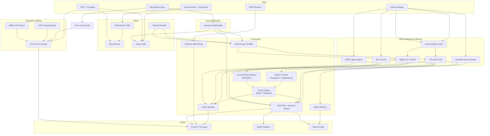

# 🦯 Bagdar

**Offline-first AI mobility assistant for visually impaired users.**

Real-time hazard detection, turn-by-turn navigation, and public transit guidance – running entirely on-device, even on budget Android hardware.


<!-- TODO: Add demo video or GIF here -->
<!--  -->

---

## Why Bagdar Exists

An estimated **2.2 billion people** worldwide live with some form of vision impairment ([WHO, 2023](https://www.who.int/news-room/fact-sheets/detail/blindness-and-visual-impairment)). The vast majority reside in low- and middle-income countries where reliable internet connectivity, modern smartphones, and accessible urban infrastructure cannot be taken for granted.

Existing assistive apps overwhelmingly depend on cloud APIs for object recognition, route planning, or scene description. This creates a hard prerequisite, a stable data connection, that excludes precisely the users who need these tools the most.

**Bagdar** takes a fundamentally different approach. Every computation, from real-time object detection and depth estimation to pedestrian routing and transit guidance, happens **entirely on the device**. No server calls, no API keys, no data plan required. The system is purpose-built to run on devices in the **$100–150 price range**, turning hardware constraints into an engineering challenge rather than accepting them as limitations.

The app currently supports **Russian**, **Kazakh**, and **English** – covering regions where accessible technology options are scarce.

---

## Key Capabilities

### 🔍 Vision Pipeline

| Feature | How It Works |
|---|---|
| **Object detection** | YOLOv8n quantized to INT8 (~3.2 MB). Runs at 8–25 FPS depending on hardware |
| **Depth estimation** | MiDaS v2.1 Small via NCNN FP16 (~32 MB) with Vulkan GPU acceleration: monocular depth without LiDAR or ToF sensor |
| **Ground plane analysis** | RANSAC-based plane fitting on the depth map. Detects potholes, steps, curbs, slopes, and overhead obstacles by measuring deviations from the estimated ground surface |
| **Multi-object tracking** | Kalman filter with Hungarian assignment and appearance embedding. Tracks identity across frames, detects approaching vehicles via bounding-box area rate, classifies turning trajectories via 3-point curvature |
| **Traffic light recognition** | Direct YUV colorimetry on the camera stream using three-zone brightness analysis with temporal confirmation. No separate model required |
| **Synthetic event camera** | Heuristic pipeline using Luma-grid differencing across left/center/right sectors. Detects fast-moving objects entering the periphery before the YOLO detector picks them up. Acts as a motion pre-alert |
| **Glass door detection** | Luma variance analysis identifies transparent surfaces that depth models misinterpret as open space |
| **Slippery surface warning** | Luma pattern analysis for high-reflectance wet or polished floors |
| **Frame quality guard** | Laplacian-variance blur detection + exposure analysis. Rejects frames that would produce unreliable detections |
| **Sensor fusion engine** | Combines depth hazard scores with YOLO confidence via EMA-smoothed temporal filtering. Reduces false positives by requiring multi-frame confirmation before alerting |

### 🎧 Acoustic Pipeline

| Feature | Details |
|---|---|
| **Acoustic World Model** | Processes the microphone array stream to understand the user's acoustic environment |
| **Ambient classification** | Classifies background noise (street, indoor, transit, quiet) to dynamically adjust alert volumes, TTS speech rates, and pipeline processing cadence |
| **Stereo bearing estimation** | Analyzes phase differences between microphones to estimate the direction of incoming sound sources |
| **Reverb classification** | Measures acoustic reverberation to assist the Indoor Gate in differentiating between open outdoor spaces and enclosed indoor environments |

### 🗣️ Accessible Interface

| Feature | Details |
|---|---|
| **Priority TTS queue** | Three-tier system (critical → warning → info) with interrupt semantics: critical alerts preempt all queued speech. Stale message pruning, per-track deduplication, stall watchdog with automatic recovery |
| **Scene Narrator** | On-demand comprehensive scene description. Synthesizes detected objects, depth hazards, traffic lights, and OCR text into a natural language snapshot with directional filtering |
| **Object Memory** | Voice-activated object finding. Users can command the system to "remember" an object, and later "find" it using a Y-histogram visual backend and a continuous audio beacon for spatial guidance |
| **Audio session management** | Proper ducking of background audio, interruption handling (phone calls, other apps), automatic route recovery when audio output changes |
| **Voice commands** | 35+ commands across 3 languages. Natural-language prefixes for navigation ("веди в аптеку", "take me to pharmacy", "дәріханаға жол көрсет"). Fall cancellation, SOS, mode switching, speech rate / volume / language control via voice |
| **Payment SMS reader** | Intercepts, parses, and reads aloud payment and balance SMS messages. Automatically extracts payment amounts, currency, and direction (incoming/outgoing) |
| **Haptic feedback** | Configurable vibration strength (weak / normal / strong). Patterns encode spatial direction (left/right/center) and urgency level |
| **Earcon audio cues** | Non-speech audio signals for events that don't warrant spoken alerts. Independently adjustable volume |
| **Pitch-black screen** | Full-black UI mode for zero display power draw while the vision pipeline continues running |
| **Guide dog mode** | Suppresses alerts that conflict with trained guide dog behavior; the dog handles obstacle avoidance, while the app provides supplementary information only |
| **Verbosity control** | Three levels (minimal / normal / detailed) integrated into the alert filter to reduce alert fatigue by suppressing lower-priority announcements |
| **Gesture tutorial** | Interactive 6-step onboarding that teaches tap, double-tap, long-press, horizontal swipe, vertical swipe, and two-finger SOS gesture, complete with voice prompts and earcon feedback |
| **Accessibility preferences** | Configurable speech rate, dominant hand, SOS trigger method, per-channel volume control, and alert frequency |

### 🧭 Offline Navigation

| Feature | Details |
|---|---|
| **Pedestrian routing** | Offline route computation from OpenStreetMap data. No server API involved |
| **Turn-by-turn guidance** | Voice instructions with compass-based relative direction ("turn left", "go straight"). Periodic progress updates |
| **Off-route detection** | Automatic rerouting when GPS indicates significant deviation. Cooldown prevents alert spam in noisy GPS environments |
| **GPS drift rejection** | Pedometer cross-validation: large GPS jumps are ignored if the step counter disagrees, which is critical for indoor/urban-canyon accuracy |
| **Public transit** | GTFS data stored locally in SQLite. Nearest stop search, route lookup, schedule queries, stop-by-stop ride tracking, auto-boarding detection via speed sensor |
| **Offline POI search** | FTS5-indexed SQLite with Levenshtein fuzzy matching. Finds places by name even with typos or partial input |
| **Waypoints** | Save and navigate back to important locations |

### 🛡️ Safety Systems

| Feature | Details |
|---|---|
| **Fall detection** | IMU-based (accelerometer + gyroscope). Three-phase FSM: freefall → impact → stillness. Gyroscope rotational impact confirmation reduces false positives from phone drops. Automatic SOS countdown with voice cancellation |
| **SOS** | One-touch emergency SMS with GPS coordinates and Google Maps link. Native SMS dispatch with retry + fallback to 112 |
| **Indoor auto-switch** | GPS quality + motion state classifier with hysteresis. Detects transition into GPS-denied environments (elevators, malls). Adjusts detection cadence to prevent battery-saving delays when you're standing in front of elevator doors |
| **Thermal protection** | Real-time battery temperature + thermal status monitoring. Four-tier severity system with committed dwell to prevent oscillation |
| **Settings backup** | QR code export/import of all user preferences to enable caregivers to configure one device and replicate settings across others |

---

## Architecture



---

## Offline Architecture

Bagdar's offline capability is not an afterthought; it is the foundational architectural decision that shaped every component.

### On-Device ML Inference

Object detection runs via **TensorFlow Lite**, depth estimation via **NCNN** with Vulkan GPU acceleration:

| Model | Format | Size | Purpose | Acceleration |
|---|---|---|---|---|
| YOLOv8n INT8 | TFLite | 3.2 MB | Object detection (80 COCO classes) | NNAPI → GPU delegate → CPU fallback |
| MiDaS v2.1 Small FP16 | NCNN | 32 MB | Monocular depth estimation | Vulkan GPU → CPU (OpenMP) |

At first launch, `DeviceCapabilityProbe` runs a **hardware capability assessment**, probing for ARCore depth sensor support, NCNN + Vulkan availability, and Android SDK level. The result determines which depth estimation tier the device will use:

```
Hardware Depth (ToF/structured light) → Best accuracy, zero ML cost
        ↓ not available
NCNN + Vulkan GPU → Good accuracy, hardware-accelerated
        ↓ not available
NCNN + CPU (OpenMP) → Good accuracy, higher power draw
        ↓ too slow / init failed
Focal-length heuristic → Basic distance estimation, minimal CPU
```

NCNN self-monitors reliability: after 3 inference failures within 5 minutes, the provider permanently disables itself and persists the decision (no further init attempts in future sessions).

This probe result is **cached across launches**; the assessment runs once and is persisted in shared preferences.

### Offline Data Stack

| Data Source | Format | Use Case |
|---|---|---|
| OpenStreetMap | Compressed routing graph | Pedestrian navigation, POI database |
| GTFS | SQLite database | Bus routes, stops, schedules, transit planning |
| POI Index | FTS5-indexed SQLite | Place name search with fuzzy matching |
| User Waypoints | SQLite | Saved locations for return navigation |

**Total on-device footprint**: ~36 MB for ML models + regional map/transit data.

---

## Performance on Mid-Range Hardware

Supporting budget devices is not a compromise; it is a **systems engineering challenge** that required rethinking how every pipeline stage operates under constrained resources.

### Adaptive Inference Scheduling

The `PerformanceThrottler` continuously monitors inference latency, thermal state, battery level, memory pressure, and user motion to dynamically adjust the processing cadence:

```
                   ┌─────────────┐
                   │ Inference   │──┐
                   │ Latency     │  │
                   └─────────────┘  │
                   ┌─────────────┐  │    ┌──────────────────┐
                   │ Thermal     │──┼───▶│ Performance      │───▶ Detection Interval
                   │ Severity    │  │    │ Throttler        │───▶ MiDaS Interval
                   └─────────────┘  │    │                  │───▶ UI Refresh Rate
                   ┌─────────────┐  │    │ (dynamic         │───▶ OCR Interval
                   │ Battery     │──┤    │  multi-signal    │
                   │ Level       │  │    │  governor)       │
                   └─────────────┘  │    └──────────────────┘
                   ┌─────────────┐  │
                   │ Motion      │──┤
                   │ State       │  │
                   └─────────────┘  │
                   ┌─────────────┐  │
                   │ Memory      │──┘
                   │ Pressure    │
                   └─────────────┘
```

### Key Optimization Strategies

| Strategy | Mechanism |
|---|---|
| **Thermal burst scheduling** | At critical temperature: process 3 frames at reduced intervals, then idle for a full cycle. Ensures hazards are not missed during thermal throttling |
| **Motion-aware cadence** | Stationary user → longer intervals (battery savings). Unstable motion → shorter intervals (heightened vigilance). Indoor override: stationary-in-elevator penalty is removed |
| **Memory-pressure response** | Low memory → increased detection intervals. Critical memory → MiDaS disabled entirely, detection intervals significantly increased |
| **Stall watchdog** | Detects pipeline stalls with thermal-state-aware thresholds. Automatically recovers detection loop if inference hangs |
| **Weather-degraded mode** | Adjusts pedestrian detection thresholds and disables staircase detection during conditions that degrade depth map quality |

### Approximate Performance Characteristics

| Metric | Mid-Range (e.g. Snapdragon 680) | Upper Mid-Range (e.g. Snapdragon 778G) |
|---|---|---|
| YOLOv8n inference | ~45 ms | ~22 ms |
| MiDaS NCNN inference | ~140 ms (Vulkan) | ~65 ms (Vulkan) |
| Effective detection FPS | 8–12 | 18–25 |
| Estimated battery drain/hr | ~15% | ~10% |

> **Note**: These are estimated figures based on development testing. Formal benchmarking across a wider range of devices is planned.

---

## Supported Languages

| | Russian | Kazakh | English |
|---|:---:|:---:|:---:|
| Voice commands | ✅ 35+ commands | ✅ 35+ commands | ✅ 35+ commands |
| TTS alerts | ✅ | ✅ | ✅ |
| OCR | ✅ | ✅ | ✅ |
| Navigation instructions | ✅ | ✅ | ✅ |
| Onboarding UI | ✅ | ✅ | ✅ |
| Voice-configurable settings | ✅ | ✅ | ✅ |

Language can be switched via voice command at any time ("русский язык" / "қазақ тілі" / "english language"). If the device's TTS engine does not support the selected language, Bagdar guides the user to install the missing language pack and falls back to English.

---

## Project Structure

```
bagdar/
├── lib/
│   ├── camera/            # Camera pipeline architecture
│   │   ├── alert_manager       # Alert routing, cooldowns, deduplication
│   │   ├── frame_quality_guard # Blur + exposure rejection
│   │   ├── depth_pipeline_controller  # Depth provider lifecycle
│   │   ├── camera_lifecycle_controller # Camera start/stop FSM
│   │   ├── fall_countdown_controller   # Fall → SOS countdown UI
│   │   ├── stall_watchdog      # Inference hang detection + recovery
│   │   └── voice_command_dispatcher    # Voice → action routing
│   ├── services/          # 39 service modules
│   │   ├── tts_service         # Priority speech queue with interrupt semantics
│   │   ├── navigation_service  # Turn-by-turn walk + transit navigation
│   │   ├── depth_provider      # Multi-tier depth estimation orchestrator
│   │   ├── ncnn_depth_provider # NCNN-based MiDaS inference + auto-disable
│   │   ├── ncnn_depth_bridge   # Native FFI bridge to NCNN C++ library
│   │   ├── fall_detector        # IMU-based fall detection FSM
│   │   ├── traffic_light_analyzer  # YUV colorimetric traffic light classification
│   │   ├── thermal_monitor     # Battery temp + thermal status polling
│   │   ├── indoor_gate         # GPS quality + motion indoor classifier
│   │   ├── motion_prealert     # Peripheral intrusion detector
│   │   ├── gtfs_service        # Offline transit data queries
│   │   ├── offline_poi_service # FTS5 + Levenshtein place search
│   │   ├── device_capability   # Hardware probe + depth tier selection
│   │   ├── memory_monitor      # Runtime memory pressure tracking
│   │   ├── feature_usage_tracker  # Feature analytics + tutorial tracking
│   │   ├── map_package_manager # City map package download + extraction
│   │   └── ...                 # SOS, compass, haptic, voice, battery, etc.
│   ├── utils/             # Vision pipeline core
│   │   ├── ground_plane_analyzer  # RANSAC plane fitting + hazard classification
│   │   ├── fusion_engine       # EMA-smoothed multi-sensor hazard confirmation
│   │   ├── blur_detector       # Laplacian-variance frame sharpness scoring
│   │   ├── performance_throttler  # Adaptive multi-signal cadence governor
│   │   ├── distance_utils      # Metric distance estimation
│   │   └── alert_filter        # Deduplication + priority routing
│   ├── tracker/           # Multi-object tracking
│   │   ├── tracker             # Kalman + Hungarian assignment
│   │   ├── kalman_box_tracker  # Per-track state estimation
│   │   ├── hungarian           # Optimal assignment solver
│   │   └── appearance          # Visual feature similarity
│   ├── models/            # Domain models + i18n (96 KB string table)
│   ├── viewmodels/        # MVVM presentation layer
│   ├── widgets/           # UI overlays, controls, HUD
│   ├── screens/           # Settings QR export/import
│   ├── gesture_tutorial_screen.dart  # Interactive gesture onboarding
│   └── camera_screen.dart # Main orchestration layer
├── tools/
│   └── analyze_session.py # Field telemetry post-processor
├── scripts/               # Data pipeline tooling
│   ├── build_ch_graph.py  # OSM PBF → binary CH routing graph
│   ├── build_gtfs_db.py   # GTFS ZIP → SQLite transit database
│   ├── build_poi_db.py    # OSM → FTS5-indexed POI database
│   ├── package_city.py    # Bundle city map package (.bagdar)
│   └── parse_perf_logs.py # Performance log analysis
├── assets/
│   ├── yolov8n_int8.tflite
│   ├── midas_small.ncnn.param
│   ├── midas_small.ncnn.bin
│   └── labels.txt
└── test/                  # 27 test files
```

**83 Dart source files** · **~752 KB** of application code · **39 service modules** · **27 unit test files**

---

## Getting Started

### Requirements

- Flutter SDK 3.11+
- Android device (physical device strongly recommended: camera, IMU, GPS, and vibration require real hardware)
- Android 5.0+ (API 21+). NNAPI acceleration available on API 28+

### Build & Run

```bash
# Install dependencies
flutter pub get

# Run on connected device
flutter run

# Analyze code
flutter analyze
```

The app guides you through onboarding on first launch: language selection, usage mode (street / guide dog), permission grants, SOS emergency contact setup, and an interactive 6-step gesture tutorial.

### Required Permissions

| Permission | Purpose |
|---|---|
| Camera | Real-time vision pipeline |
| Microphone | Voice commands |
| Location | Navigation, SOS coordinates |
| SMS | Native SOS message dispatch |
| Sensors | Fall detection (accelerometer, gyroscope) |
| Vibration | Haptic directional feedback |

---

## Roadmap

- [ ] Formal benchmarking suite across 10+ device models
- [ ] Expanded hazard detection: construction zones, uneven terrain grading
- [ ] Crowd-sourced hazard reporting between users
- [ ] iOS support
- [ ] Additional language packs (Turkish, Arabic, Hindi)
- [ ] Integration with municipal accessibility APIs where available
- [ ] Proximity beacon support for indoor wayfinding

---

## License

This project is licensed under the [MIT License](LICENSE) - © 2026 Nurmukhamed Sabit.

---

<p align="center">
  <em>Built to work where infrastructure doesn't.</em>
</p>
