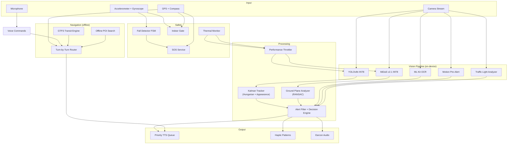

# 🦯 Bagdar

**Offline-first AI mobility assistant for visually impaired users.**

Real-time hazard detection, turn-by-turn navigation, and public transit guidance — running entirely on-device, even on budget Android hardware.


<!-- TODO: Add demo video or GIF here -->
<!--  -->

---

## Why Bagdar Exists

An estimated **2.2 billion people** worldwide live with some form of vision impairment ([WHO, 2023](https://www.who.int/news-room/fact-sheets/detail/blindness-and-visual-impairment)). The vast majority reside in low- and middle-income countries where reliable internet connectivity, modern smartphones, and accessible urban infrastructure cannot be taken for granted.

Existing assistive apps overwhelmingly depend on cloud APIs for object recognition, route planning, or scene description. This creates a hard prerequisite — a stable data connection — that excludes precisely the users who need these tools the most.

**Bagdar** takes a fundamentally different approach. Every computation — from real-time object detection and depth estimation to pedestrian routing and transit guidance — happens **entirely on the device**. No server calls, no API keys, no data plan required. The system is purpose-built to run on devices in the **$100–150 price range**, turning hardware constraints into an engineering challenge rather than accepting them as limitations.

The app currently supports **Russian**, **Kazakh**, and **English** — covering regions where accessible technology options are scarce.

---

## Key Capabilities

### 🔍 Vision Pipeline

| Feature | How It Works |
|---|---|
| **Object detection** | YOLOv8n quantized to INT8 (~3.2 MB). Runs at 8–25 FPS depending on hardware |
| **Depth estimation** | MiDaS v2.1 Small INT8 (~15.9 MB) — monocular depth without LiDAR or ToF sensor |
| **Ground plane analysis** | RANSAC-based plane fitting on the depth map. Detects potholes, steps, curbs, slopes, and overhead obstacles by measuring deviations from the estimated ground surface |
| **Multi-object tracking** | Kalman filter with Hungarian assignment and appearance embedding. Tracks identity across frames, detects approaching vehicles via bounding-box area rate, classifies turning trajectories via 3-point curvature |
| **Traffic light recognition** | Direct YUV colorimetry on the camera stream — three-zone brightness analysis with temporal confirmation. No separate model required |
| **Peripheral motion alert** | Luma-grid differencing across left/center/right sectors detects fast-moving objects entering the field of view before the detector picks them up |
| **Glass door detection** | Luma variance analysis identifies transparent surfaces that depth models misinterpret as open space |
| **Slippery surface warning** | Luma pattern analysis for high-reflectance wet or polished floors |

### 🗣️ Accessible Interface

| Feature | Details |
|---|---|
| **Priority TTS queue** | Three-tier system (critical → warning → info) with interrupt semantics: critical alerts preempt all queued speech. Stale message pruning, per-track deduplication, stall watchdog with automatic recovery |
| **Audio session management** | Proper ducking of background audio, interruption handling (phone calls, other apps), automatic route recovery when audio output changes |
| **Voice commands** | 30+ commands across 3 languages. Natural-language prefixes for navigation ("веди в аптеку", "take me to pharmacy", "маған жол көрсет аптека"). Fall cancellation, SOS, mode switching |
| **Haptic feedback** | Vibration patterns encode spatial direction (left/right/center) and urgency level |
| **Earcon audio cues** | Non-speech audio signals for events that don't warrant spoken alerts |
| **Pitch-black screen** | Full-black UI mode — zero display power draw while the vision pipeline continues running |
| **Guide dog mode** | Suppresses alerts that conflict with trained guide dog behavior — the dog handles obstacle avoidance, the app provides supplementary information only |

### 🧭 Offline Navigation

| Feature | Details |
|---|---|
| **Pedestrian routing** | Offline route computation from OpenStreetMap data. No server API involved |
| **Turn-by-turn guidance** | Voice instructions with compass-based relative direction ("turn left", "go straight"). Periodic progress updates |
| **Off-route detection** | Automatic rerouting when GPS indicates significant deviation. Cooldown prevents alert spam in noisy GPS environments |
| **GPS drift rejection** | Pedometer cross-validation: large GPS jumps are ignored if the step counter disagrees — critical for indoor/urban-canyon accuracy |
| **Public transit** | GTFS data stored locally in SQLite. Nearest stop search, route lookup, schedule queries, stop-by-stop ride tracking, auto-boarding detection via speed sensor |
| **Offline POI search** | FTS5-indexed SQLite with Levenshtein fuzzy matching. Finds places by name even with typos or partial input |
| **Waypoints** | Save and navigate back to important locations |

### 🛡️ Safety Systems

| Feature | Details |
|---|---|
| **Fall detection** | IMU-based (accelerometer + gyroscope). Three-phase FSM: freefall → impact → stillness. Gyroscope rotational impact confirmation reduces false positives from phone drops. Automatic SOS countdown with voice cancellation |
| **SOS** | One-touch emergency SMS with GPS coordinates and Google Maps link. Native SMS dispatch with retry + fallback to 112 |
| **Indoor auto-switch** | GPS quality + motion state classifier with hysteresis. Detects transition into GPS-denied environments (elevators, malls). Adjusts detection cadence — no battery-saving delay when you're standing in front of elevator doors |
| **Thermal protection** | Real-time battery temperature + thermal status monitoring. Four-tier severity system with committed dwell to prevent oscillation |
| **Settings backup** | QR code export/import of all user preferences — enables caregivers to configure one device and replicate settings across others |

---

## Architecture



---

## Offline Architecture

Bagdar's offline capability is not an afterthought — it is the foundational architectural decision that shaped every component.

### On-Device ML Inference

Both neural network models run via **TensorFlow Lite** with automatic hardware acceleration:

| Model | Size | Purpose | Acceleration |
|---|---|---|---|
| YOLOv8n INT8 | 3.2 MB | Object detection (80 COCO classes) | NNAPI → GPU delegate → CPU fallback |
| MiDaS v2.1 Small INT8 | 15.9 MB | Monocular depth estimation | NNAPI → CPU fallback |

At first launch, `DeviceCapabilityProbe` runs a **hardware capability assessment** — probing for ARCore depth sensor support, NNAPI availability, and Android SDK level. The result determines which depth estimation tier the device will use:

```
Hardware Depth (ToF/structured light) → Best accuracy, zero ML cost
        ↓ not available
MiDaS + NNAPI acceleration → Good accuracy, hardware-accelerated
        ↓ not available
MiDaS + CPU → Good accuracy, higher power draw
        ↓ too slow
Focal-length heuristic → Basic distance estimation, minimal CPU
```

This probe result is **cached across launches** — the assessment runs once and is persisted in shared preferences.

### Offline Data Stack

| Data Source | Format | Use Case |
|---|---|---|
| OpenStreetMap | Compressed routing graph | Pedestrian navigation, POI database |
| GTFS | SQLite database | Bus routes, stops, schedules, transit planning |
| POI Index | FTS5-indexed SQLite | Place name search with fuzzy matching |
| User Waypoints | SQLite | Saved locations for return navigation |

**Total on-device footprint**: ~20 MB for ML models + regional map/transit data.

---

## Performance on Mid-Range Hardware

Supporting budget devices is not a compromise — it is a **systems engineering challenge** that required rethinking how every pipeline stage operates under constrained resources.

### Adaptive Inference Scheduling

The `PerformanceThrottler` continuously monitors inference latency, thermal state, battery level, memory pressure, and user motion to dynamically adjust the processing cadence:

```
                   ┌─────────────┐
                   │  Inference   │
                   │  Latency     │──┐
                   └─────────────┘  │
                   ┌─────────────┐  │    ┌──────────────────┐
                   │  Thermal     │──┼───▶│  Performance      │───▶ Detection Interval
                   │  Severity    │  │    │  Throttler        │───▶ MiDaS Interval
                   └─────────────┘  │    │                    │───▶ UI Refresh Rate
                   ┌─────────────┐  │    │  (dynamic          │───▶ OCR Interval
                   │  Battery     │──┤    │   multi-signal     │
                   │  Level       │  │    │   governor)        │
                   └─────────────┘  │    └──────────────────┘
                   ┌─────────────┐  │
                   │  Motion      │──┤
                   │  State       │  │
                   └─────────────┘  │
                   ┌─────────────┐  │
                   │  Memory      │──┘
                   │  Pressure    │
                   └─────────────┘
```

### Key Optimization Strategies

| Strategy | Mechanism |
|---|---|
| **Thermal burst scheduling** | At critical temperature: process 3 frames at reduced intervals, then idle for a full cycle. Ensures hazards are not missed during thermal throttling |
| **Motion-aware cadence** | Stationary user → longer intervals (battery savings). Unstable motion → shorter intervals (heightened vigilance). Indoor override: stationary-in-elevator penalty is removed |
| **Memory-pressure response** | Low memory → increased detection intervals. Critical memory → MiDaS disabled entirely, detection intervals significantly increased |
| **Stall watchdog** | Detects pipeline stalls with thermal-state-aware thresholds. Automatically recovers detection loop if inference hangs |
| **Weather-degraded mode** | Adjusts pedestrian detection thresholds and disables staircase detection during conditions that degrade depth map quality |

### Approximate Performance Characteristics

| Metric | Mid-Range (e.g. Snapdragon 680) | Upper Mid-Range (e.g. Snapdragon 778G) |
|---|---|---|
| YOLOv8n inference | ~45 ms | ~22 ms |
| MiDaS inference | ~180 ms | ~85 ms |
| Effective detection FPS | 8–12 | 18–25 |
| Estimated battery drain/hr | ~15% | ~10% |

> **Note**: These are estimated figures based on development testing. Formal benchmarking across a wider range of devices is planned.

---

## Supported Languages

| | Russian | Kazakh | English |
|---|:---:|:---:|:---:|
| Voice commands | ✅ 30+ commands | ✅ 30+ commands | ✅ 30+ commands |
| TTS alerts | ✅ | ✅ | ✅ |
| OCR | ✅ | ✅ | ✅ |
| Navigation instructions | ✅ | ✅ | ✅ |
| Onboarding UI | ✅ | ✅ | ✅ |

If the device's TTS engine does not support the selected language, Bagdar automatically falls back to English and adjusts all alert strings accordingly.

---

## Project Structure

```
bagdar/
├── lib/
│   ├── services/          # 37 service modules
│   │   ├── tts_service         # Priority speech queue with interrupt semantics
│   │   ├── navigation_service  # Turn-by-turn walk + transit navigation
│   │   ├── depth_provider      # Multi-tier depth estimation orchestrator
│   │   ├── fall_detector        # IMU-based fall detection FSM
│   │   ├── traffic_light_analyzer  # YUV colorimetric traffic light classification
│   │   ├── thermal_monitor     # Battery temp + thermal status polling
│   │   ├── indoor_gate         # GPS quality + motion indoor classifier
│   │   ├── motion_prealert     # Peripheral intrusion detector
│   │   ├── gtfs_service        # Offline transit data queries
│   │   ├── offline_poi_service # FTS5 + Levenshtein place search
│   │   ├── device_capability   # Hardware probe + depth tier selection
│   │   └── ...                 # SOS, compass, haptic, voice, battery, etc.
│   ├── utils/             # Vision pipeline core
│   │   ├── ground_plane_analyzer  # RANSAC plane fitting + hazard classification
│   │   ├── midas_service       # MiDaS depth map inference
│   │   ├── performance_throttler  # Adaptive multi-signal cadence governor
│   │   ├── distance_utils      # Metric distance estimation
│   │   └── alert_filter        # Deduplication + priority routing
│   ├── tracker/           # Multi-object tracking
│   │   ├── tracker             # Kalman + Hungarian assignment
│   │   ├── kalman_box_tracker  # Per-track state estimation
│   │   ├── hungarian           # Optimal assignment solver
│   │   └── appearance          # Visual feature similarity
│   ├── models/            # Domain models + i18n (87 KB string table)
│   ├── viewmodels/        # MVVM presentation layer
│   ├── widgets/           # UI overlays, controls, HUD
│   ├── screens/           # Settings QR export/import
│   └── camera_screen.dart # Main orchestration layer
├── tools/
│   └── analyze_session.py # Field telemetry post-processor
├── assets/
│   ├── yolov8n_int8.tflite
│   ├── midas_small_int8.tflite
│   └── labels.txt
└── plans/                 # Development roadmaps
```

**81 Dart source files** · **~718 KB** of application code · **37 service modules**

---

## Getting Started

### Requirements

- Flutter SDK 3.11+
- Android device (physical device strongly recommended — camera, IMU, GPS, and vibration require real hardware)
- Android 5.0+ (API 21+). NNAPI acceleration available on API 28+

### Build & Run

```bash
# Install dependencies
flutter pub get

# Run on connected device
flutter run

# Analyze code
flutter analyze
```

The app guides you through onboarding on first launch — language selection, permission grants, and an interactive gesture tutorial.

### Required Permissions

| Permission | Purpose |
|---|---|
| Camera | Real-time vision pipeline |
| Microphone | Voice commands |
| Location | Navigation, SOS coordinates |
| SMS | Native SOS message dispatch |
| Sensors | Fall detection (accelerometer, gyroscope) |
| Vibration | Haptic directional feedback |

---

## Field Testing & Telemetry

Bagdar includes a built-in **field telemetry system** for data-driven performance analysis:

- `FieldLogger` records structured JSON-lines during live sessions — vision pipeline timings, TTS events, hazard detections, throttler state
- `tools/analyze_session.py` post-processes telemetry logs to produce per-session reports: inference latency distributions, detection coverage, thermal behavior, alert statistics

This system enables systematic evaluation of detection accuracy and pipeline stability across different devices and real-world environments.

---

## Roadmap

- [ ] Formal benchmarking suite across 10+ device models
- [ ] Expanded hazard detection: construction zones, uneven terrain grading
- [ ] Crowd-sourced hazard reporting between users
- [ ] iOS support
- [ ] Additional language packs (Turkish, Arabic, Hindi)
- [ ] Integration with municipal accessibility APIs where available

---

## License

This project is licensed under the [MIT License](LICENSE).

---

<p align="center">
  <em>Built to work where infrastructure doesn't.</em>
</p>
